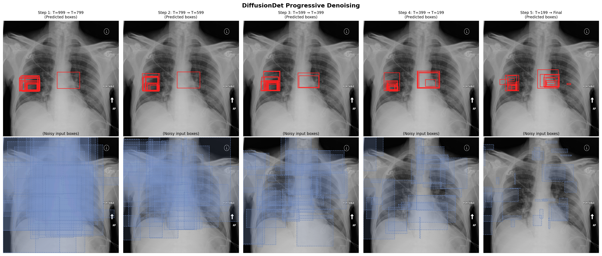
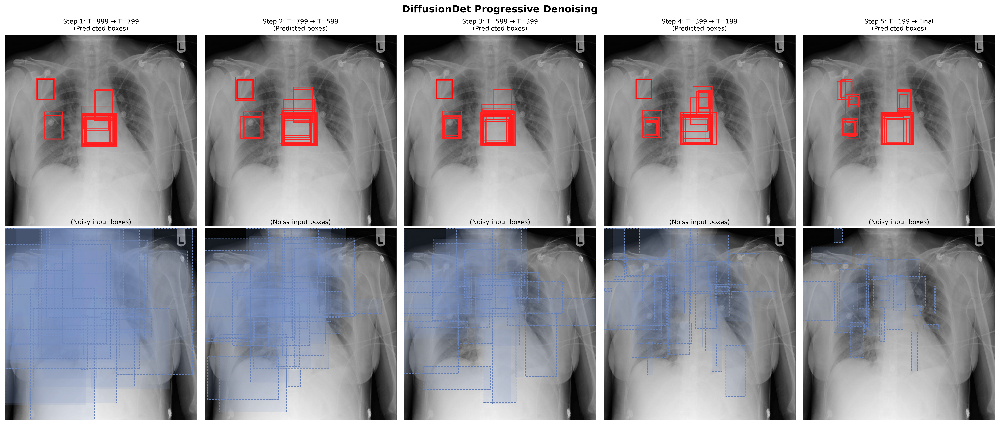
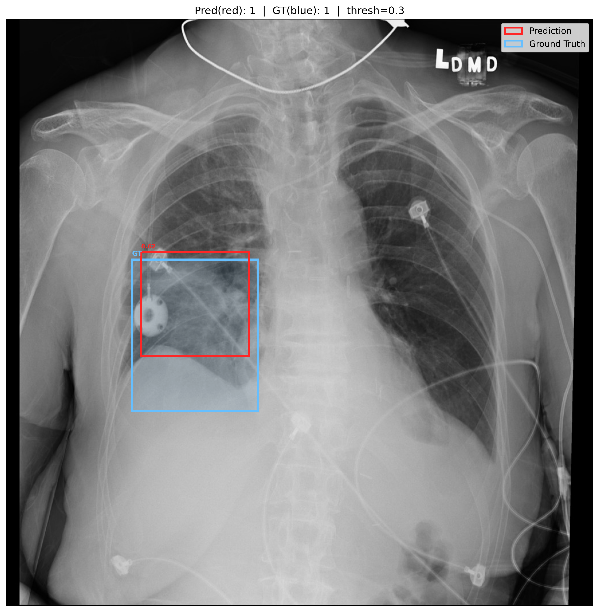
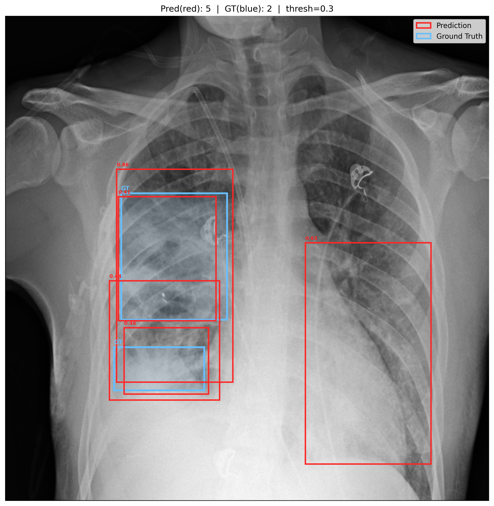
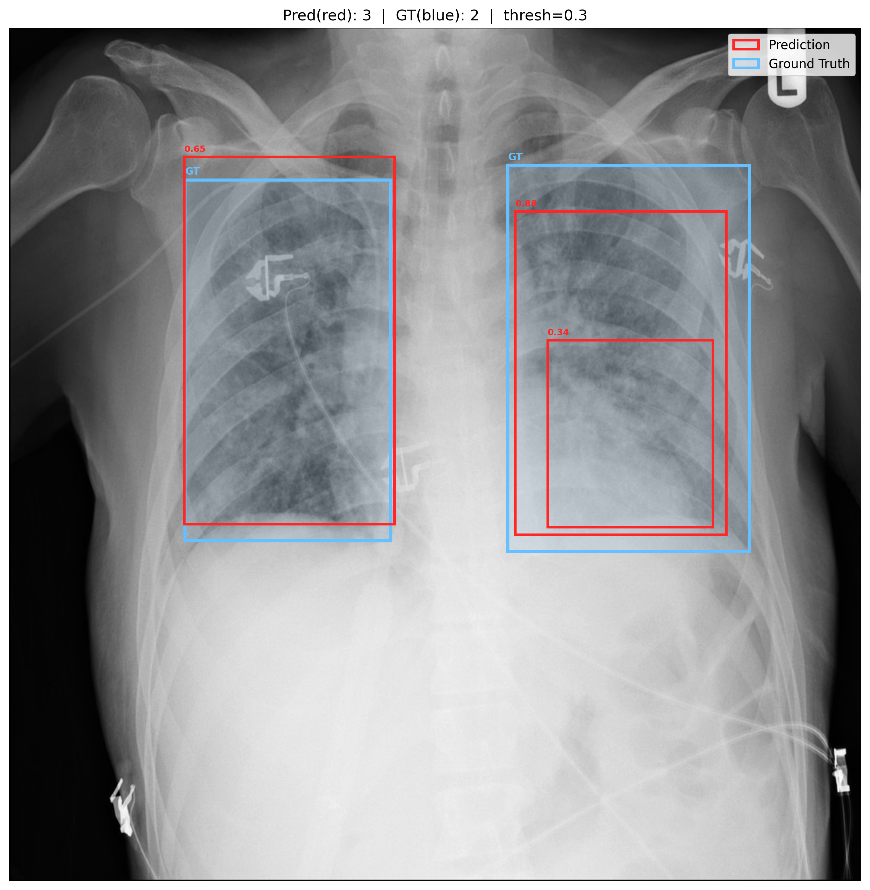
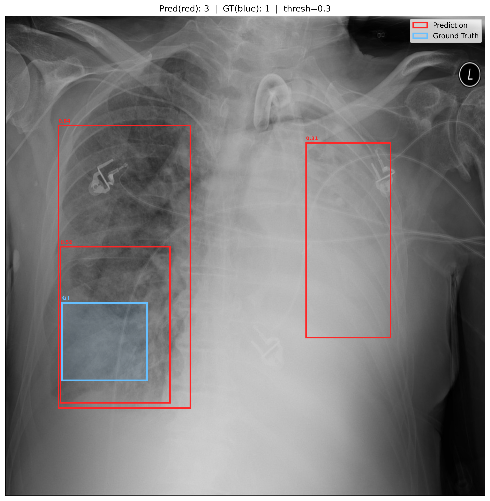
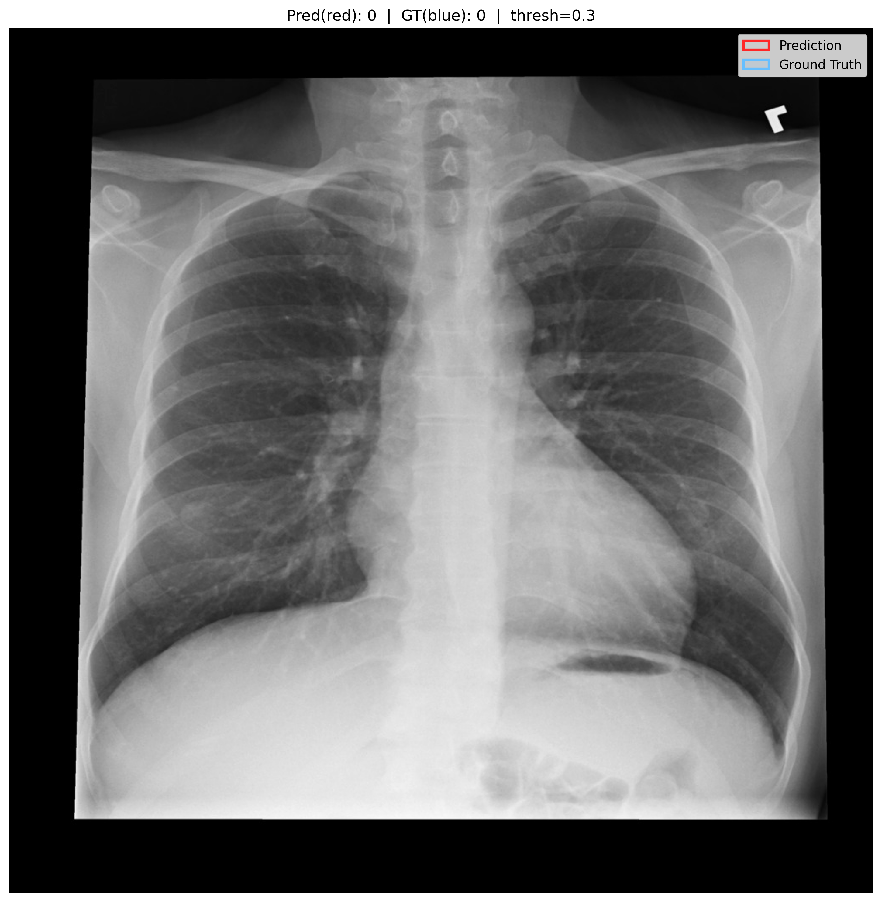
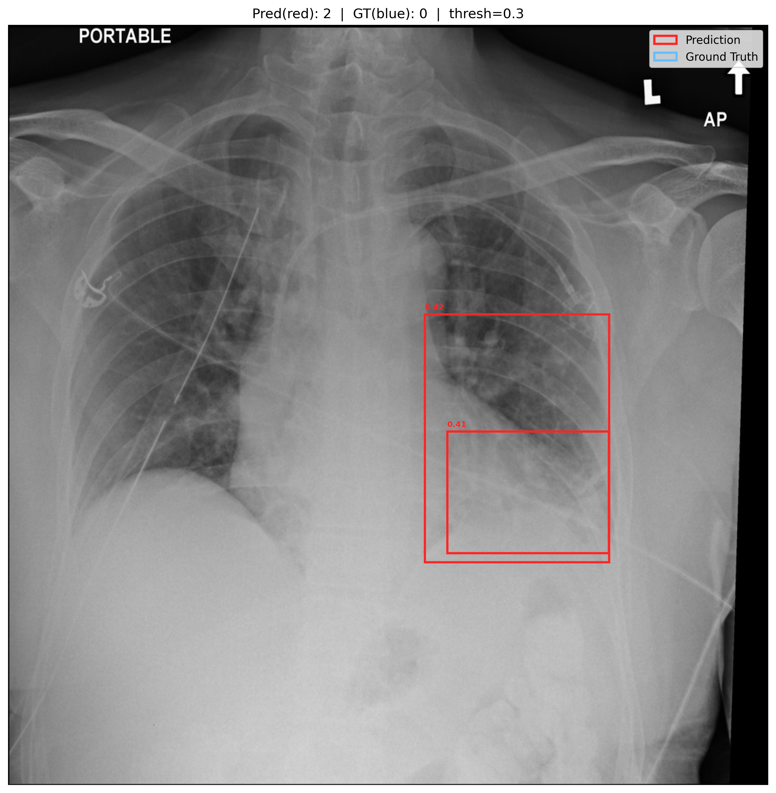

# Task 1：基于扩散模型的肺炎病灶检测实验报告

## 1 团队信息与分工
| 贺子鲲 | 刘恒畅 |
|---|---|
|数据集构建划分，DiffusionDet、Faster R-CNN代码实现，模型训练微调，结果分析与报告撰写| 部分代码实现，结果分析整理，Task1 PPT制作与展示 |

## 2 项目概述

本实验为计算机视觉导论课程 Final Project 的 Task 1 部分，旨在使用生成式模型完成肺炎病灶检测任务，并与 Assignment 1 中的判别式方法进行对比分析。

我们选择了 **DiffusionDet**（Diffusion Model for Object Detection）作为生成式检测框架，该方法由 Chen et al. 于 2022 年提出，是首个将扩散模型应用于目标检测的工作。DiffusionDet 将目标检测建模为从噪声框到目标框的逐步去噪过程：训练阶段对 ground-truth 边界框添加高斯噪声，模型学习预测去噪后的框；推理阶段从随机采样的噪声框出发，通过多步 DDIM 去噪迭代，逐步收敛到目标位置。

作为判别式基线，我们同时训练了 Faster R-CNN 模型，使用相同的数据集和 backbone，从精度、速度、训练成本等维度进行全面对比。

---

## 3 方法描述

### 3.1 DiffusionDet 核心原理

DiffusionDet 的核心思想是将目标检测重新定义为一个噪声到边界框的生成过程，其建模方式与传统判别式检测器截然不同：

**训练阶段**：给定 ground-truth 边界框 $b_0$，按照预定义的噪声调度 $\{\beta_t\}_{t=1}^T$ 逐步添加高斯噪声：

$$q(b_t | b_{t-1}) = \mathcal{N}(b_t; \sqrt{1 - \beta_t} \, b_{t-1}, \beta_t \mathbf{I})$$

模型以带噪声的边界框 $b_t$ 和对应的图像特征为条件，学习预测信号 $b_0$（signal prediction 模式）。

**推理阶段**：从纯噪声框 $b_T \sim \mathcal{N}(0, \mathbf{I})$ 出发，使用 DDIM（Denoising Diffusion Implicit Models）采样策略进行多步去噪：

$$b_{t-1} = \sqrt{\bar{\alpha}_{t-1}} \cdot \hat{b}_0 + \sqrt{1 - \bar{\alpha}_{t-1}} \cdot \epsilon_\theta(b_t, t)$$

其中 $\hat{b}_0$ 为模型预测的去噪框，通过迭代最终得到精确的目标边界框。

**模型架构**：DiffusionDet 采用标准的 backbone + detection head 结构：
- **Backbone**：ResNet-50 / ResNet-101 + FPN（Feature Pyramid Network），提取多尺度图像特征；
- **Detection Head**：基于 RoI 特征的检测头，接收噪声框的 RoI 特征和时间步编码，输出去噪后的边界框和分类分数；
- **优化器**：AdamW，配合梯度裁剪（clip_value=1.0）和学习率预热策略。

### 3.2 Faster R-CNN 基线

Faster R-CNN 是经典的两阶段判别式检测器，采用 RPN（Region Proposal Network）生成候选区域，再通过 RoI Head 进行分类和框回归。其特点是**一次前向传播即可得到最终检测结果**，无需多步迭代。

在本实验中，Faster R-CNN 同样使用 ResNet-50 / ResNet-101 + FPN 作为 backbone，保证与 DiffusionDet 在特征提取层面的公平对比。

---

## 4 数据准备

### 4.1 数据集说明

本实验使用 RSNA Pneumonia Detection Challenge 数据集，该数据集包含大量胸部 X 光 DICOM 图像及对应的肺炎病灶标注。原始标注文件为 `stage_2_train_labels.csv`，包含 `patientId`、`x`、`y`、`width`、`height`、`Target` 等字段。

为探究数据规模对模型性能的影响，我们构建了两个不同规模的子集：

| 数据集名称 | 总样本数 | 训练集 | 验证集 | 正负比例 | 训练集 bbox 数 |
|-----------|---------|--------|--------|---------|---------------|
| **sRSNA**（抽样子集） | 10,000 | 7,000（正3521 / 负3479） | 3,000 | ≈1:1 | 5,596 |
| **lRSNA**（大规模集） | 18,512 | 14,809（正4829 / 负9980） | 3,703 | ≈1:2 | 7,684 |

### 4.2 数据处理流程

数据准备的代码实现位于 `RSNA.ipynb`（sRSNA 子集）和 `LRSNA.ipynb`（lRSNA 全集），主要包括以下步骤：

**Step 1：均衡采样与数据划分**

我们实现了 `split_sample` 函数，按患者为单位进行数据划分，确保同一患者的所有图像不会同时出现在训练集和验证集中。该函数首先将患者分为阳性组和阴性组，分别随机抽取指定数量的患者，保证正负样本均衡。对于 sRSNA 子集，正负各取 5000 名患者（总共 10000 张），训练集占 70%；对于 lRSNA 大规模集，取全部可用患者（共 18512 张），训练集占 80%。

每张 DICOM 图像在 Assignment 1 中已预处理为 `.pth` 格式的 tensor 文件，`split_sample` 函数直接加载这些 tensor 并聚合每位患者的所有标注框信息，生成包含 `patientId`、`Target`、`bboxes`、`img` 的字典列表。

**Step 2：COCO 格式转换**

DiffusionDet 基于 Detectron2 框架，要求训练数据遵循 COCO 标注格式。我们实现了 `convert2coco` 函数，完成以下转换：

1. 将每张图像的 tensor 转换为 JPG 格式，保存到 `train2017/` 和 `val2017/` 目录；
2. 从原始 CSV 标注中提取边界框信息，生成符合 COCO 格式的 `train_data.json` 和 `val_data.json` 标注文件，包含 `images`、`annotations`、`categories` 三个字段；
3. 标注中的类别统一为 `pneumonia`（category_id=1），边界框格式为 `[x, y, width, height]`。

最终的数据集目录结构如下：
```
dataset/
├── RSNA/                    # sRSNA 抽样子集
│   ├── annotations/
│   │   ├── train_data.json
│   │   └── val_data.json
│   ├── train2017/           # 7000 张训练图像
│   └── val2017/             # 3000 张验证图像
└── LRSNA/                   # lRSNA 大规模集
    ├── annotations/
    │   ├── train_data.json
    │   └── val_data.json
    ├── train2017/           # 14809 张训练图像
    └── val2017/             # 3703 张验证图像
```

### 4.3 数据集注册

由于 Detectron2 需要通过 `DatasetCatalog` 管理数据集，我们在训练脚本 `train_net.py` 和 `train_fasterrcnn.py` 中分别实现了 `register_rsna_dataset` 函数，仿照 Detectron2 内置的 COCO 数据集注册方式，将 RSNA 数据集注入框架。注册时指定了 `thing_classes=["pneumonia"]` 和 `evaluator_type="coco"`，使得模型训练和评估过程可以直接调用 Detectron2 提供的 `COCOEvaluator` 进行标准化的 mAP 评估。

---

## 5 模型训练

### 5.1 训练环境

- **GPU**：NVIDIA A40 \(\times\) 8（多 GPU 分布式训练）
- **框架**：PyTorch + Detectron2
- **DiffusionDet 版本**：基于官方开源代码（arXiv 2211.09788）
- **预训练权重**：ImageNet 预训练的 ResNet-50 / ResNet-101

### 5.2 新数据集适配

由于训练过程中需要使用我们构建好的 RSNA 数据集，在训练开始前需要将新的数据集注入 Detectron2。我们仿照 Detectron2 项目库 `coco.py` 源码实现了数据集注入函数 `register_rsna_dataset`，并将其封装到 `train_net.py`（DiffusionDet）和 `train_fasterrcnn.py`（Faster R-CNN）中，在模型配置初始化阶段自动完成注册。

DiffusionDet 的训练还使用了专门的 `DiffusionDetDatasetMapper` 进行数据增强，包含多尺度训练（最短边从 480 到 800 像素随机选择）和随机裁剪等策略。

### 5.3 超参数设置

我们在 sRSNA 和 lRSNA 两个数据集上，分别对 DiffusionDet（Res50 / Res101）和 Faster R-CNN（Res50 / Res101）进行了多组实验，探索不同超参数设置对检测精度的影响。各实验的详细配置如下：

#### sRSNA 数据集实验组

| 实验编号 | 模型 | Backbone | MAX_ITER | Learning Rate | Batch Size |
|---------|------|----------|----------|---------------|------------|
| S1 | DiffusionDet | Res50 | 2,500 | 5e-5 | 32 |
| S2 | DiffusionDet | Res50 | 5,000 | 8e-5 | 56 |
| S3 | DiffusionDet | Res50 | 8,000 | 8e-5 | 56 |
| S4 | DiffusionDet | Res50 | 10,000 | 1.5e-4 | 64 |
| S5 | DiffusionDet | Res101 | 2,500 | 8e-5 | 32 |
| S6 | DiffusionDet | Res101 | 8,000 | 8e-5 | 56 |
| S7 | DiffusionDet | Res101 | 10,000 | 5e-5 | 64 |
| S8 | Faster R-CNN | Res50 | 5,000 | 0.005 | 16 |
| S9 | Faster R-CNN | Res101 | 5,000 | 0.005 | 16 |

#### lRSNA 数据集实验组

| 实验编号 | 模型 | Backbone | MAX_ITER | Learning Rate | Batch Size |
|---------|------|----------|----------|---------------|------------|
| L1 | DiffusionDet | Res50 | 3,000 | 8e-5 | 32 |
| L2 | DiffusionDet | Res101 | 3,000 | 8e-5 | 32 |
| L3 | Faster R-CNN | Res50 | 6,000 | 0.005 | 16 |
| L4 | Faster R-CNN | Res101 | 6,000 | 0.005 | 16 |

所有 DiffusionDet 模型均使用 DDIM 采样策略，推理时默认设置 `SAMPLE_STEP=5`，`NUM_PROPOSALS=500`（初始噪声框数量）。训练过程中每 500 个 iteration 保存一次 checkpoint 并在验证集上评估，便于追踪模型性能变化并选择最佳模型。

### 5.4 训练 Loss 曲线

所有实验的训练 loss 变化曲线如下图所示：


从 loss 曲线中可以观察到以下趋势：

1. **DiffusionDet 的收敛特性**：DiffusionDet 的 loss 在训练初期下降较快，约 1000–2000 iteration 后逐渐趋于平稳。由于扩散模型的训练目标是噪声预测/信号预测，其 loss 值整体偏低（通常在 1.5–3.0 之间）。
2. **Faster R-CNN 的收敛特性**：Faster R-CNN 的 loss 同样呈下降趋势，但其 loss 值的绝对量级与 DiffusionDet 不同（包含 RPN loss 和 RoI loss 等多个组成部分），不宜直接比较数值大小。
3. **过拟合现象**：在 MAX_ITER=10000 的实验中，无论是 Res50 还是 Res101，DiffusionDet 均出现了一定程度的过拟合。这是因为 RSNA 训练集（sRSNA 仅 7000 张）相较于 DiffusionDet 原始实验使用的 COCO 数据集（11.8 万张）规模过小，参数量较大的模型在小数据集上更容易过拟合。因此，选择合适的 MAX_ITER 和学习率对模型性能至关重要。

---

## 6 可视化

### 6.1 生成过程可视化

DiffusionDet 的核心特征在于其**渐进式去噪推理过程**。我们使用训练好的 DiffusionDet-Res50 模型（`optres50`，SAMPLE_STEP=5），选取测试图像可视化了从噪声框到最终预测框的完整演变过程。

可视化脚本 `vis_diffusion.py` 通过调用模型内部的 `ddim_sample_visualization` 接口，记录每个去噪步骤中的中间结果，包括：
- **上行（Predicted boxes）**：模型在每一步预测的"干净"边界框 $\hat{b}_0$，即模型当前对最终检测结果的最佳估计；
- **下行（Noisy input boxes）**：当前步骤输入的带噪声边界框，作为下一步去噪的起点。

以下为 2 张测试图像的渐进去噪过程可视化结果：






从可视化结果中可以清晰地观察到 DiffusionDet 的渐进去噪特性：

1. **Step 1（T=999）**：初始噪声框分布在图像的各个位置，大小和位置均呈随机分布，此时模型已能初步识别出可能的目标区域，但预测框的位置和大小精度较低；
2. **Step 2–3**：随着去噪步骤的推进，预测框逐渐向目标区域聚集，框的大小也更加接近实际病灶尺寸，同时低置信度的噪声框被逐步过滤；
3. **Step 4–5（最终输出）**：预测框已经高度集中在病灶区域，框的位置和大小与 ground truth 接近，置信度分数也趋于稳定。

这一过程直观地展示了生成式检测方法的独特优势——通过多步迭代逐步精化预测结果，而非像判别式方法那样一步到位。

### 6.2 结果可视化

我们使用 `predict.py` 脚本对测试集中的多张图像进行推理，并绘制预测框（红色）与真实框（浅蓝色）的对比可视化。以下展示部分代表性的检测结果示例：

**DiffusionDet 检测结果：**









从可视化结果可以看出，DiffusionDet 能够较好地定位肺炎病灶区域，预测框与真实框之间有较高的重叠度。每个预测框上方标注了对应的置信度分数，高置信度的预测框通常与 ground truth 有更好的对齐。

**典型案例分析：**







- 对于典型的阳性样本（存在明显病灶），模型能够正确检测到病灶位置，但预测框与 GT 框的精确对齐仍存在一定偏差；
- 对于阴性样本（无病灶），模型在较高阈值下不会产生误报，表明模型具有一定的判别能力；
- 在较低置信度阈值下，模型会产生一些假阳性检测，这是扩散模型在小数据集上未充分收敛的表现。

---

## 7 量化评估与对比分析

### 7.1 不同训练设置下的检测精度

我们在 sRSNA 和 lRSNA 两个数据集上系统对比了不同模型和超参数配置下的检测精度。评估指标采用 COCO 标准的 mAP@0.5 和 mAP@0.5:0.95，取各实验中验证集上的最佳 checkpoint 结果。

#### sRSNA 数据集（抽样子集，10,000 张）

| 排名 | 模型 | Backbone | MAX_ITER | LR | Batch Size | mAP@0.5:0.95 | mAP@50 |
|-----|------|----------|----------|-----|------------|-------------|--------|
| 1 | Faster R-CNN | Res101 | 5,000 | 0.005 | 16 | 16.05 | **48.20** |
| 2 | DiffusionDet | Res50 | 8,000 | 8e-5 | 56 | 14.58 | **46.92** |
| 3 | Faster R-CNN | Res50 | 5,000 | 0.005 | 16 | 14.97 | 46.15 |
| 4 | DiffusionDet | Res101 | 8,000 | 8e-5 | 56 | 14.96 | 44.46 |
| 5 | DiffusionDet | Res50 | 2,500 | 5e-5 | 32 | 14.42 | 44.63 |
| 6 | DiffusionDet | Res101 | 2,500 | 8e-5 | 32 | 14.63 | 43.71 |
| 7 | DiffusionDet | Res50 | 5,000 | 8e-5 | 56 | 13.09 | 41.07 |
| 8 | DiffusionDet | Res101 | 10,000 | 1.5e-4 | 64 | 12.51 | 38.49 |
| 9 | DiffusionDet | Res50 | 10,000 | 1.5e-4 | 64 | 12.00 | 38.13 |

#### lRSNA 数据集（大规模集，18,512 张）

| 排名 | 模型 | Backbone | MAX_ITER | LR | Batch Size | mAP@0.5:0.95 | mAP@50 |
|-----|------|----------|----------|-----|------------|-------------|--------|
| 1 | DiffusionDet | Res101 | 3,000 | 8e-5 | 32 | **15.71** | **42.14** |
| 2 | Faster R-CNN | Res101 | 6,000 | 0.005 | 16 | 13.29 | 40.07 |
| 3 | DiffusionDet | Res50 | 3,000 | 8e-5 | 32 | 11.09 | 37.68 |
| 4 | Faster R-CNN | Res50 | 6,000 | 0.005 | 16 | 11.64 | 36.92 |

### 7.2 关键发现

**（1）最优模型配置**

在 sRSNA 数据集上，DiffusionDet 的最佳配置为 **Res50 + MAX_ITER=8000 + LR=8e-5 + Batch=56**（实验 S3），取得了 mAP@50=46.92 的成绩，已经接近 Faster R-CNN-Res50 的 46.15，但仍略低于 Faster R-CNN-Res101 的 48.20。

在 lRSNA 数据集上，**DiffusionDet-Res101 以 mAP@50=42.14 超越了 Faster R-CNN-Res101 的 40.07**，这表明当数据规模增大时，DiffusionDet 作为生成式模型的优势开始显现——更大的数据集能够让参数更多的扩散模型更充分地学习数据分布。

**（2）训练迭代次数的影响**

从 sRSNA 的实验结果中可以明显看到，过长的训练迭代（MAX_ITER=10000）反而导致性能严重下降（mAP@50 从 46.92 下降到 38.13），这是典型的过拟合现象。sRSNA 数据集仅有 7000 张训练图像，远少于 DiffusionDet 原始实验使用的 COCO 数据集（11.8 万张），因此模型在训练后期容易记忆训练样本而丧失泛化能力。最佳的 MAX_ITER 约在 2500–8000 之间，需要根据验证集的 AP 曲线来选择 early stopping 点。

**（3）Backbone 深度的影响**

一个值得关注的现象是：在 sRSNA 小数据集上，**DiffusionDet-Res50 的表现优于 Res101**（46.92 vs 44.46）。这与直觉相反——通常更深的 backbone 应带来更强的特征提取能力。但在小数据集场景下，Res101 的参数量（约 44.5M）显著大于 Res50（约 25.6M），更容易过拟合。而在 lRSNA 大数据集上，Res101 反超 Res50（42.14 vs 37.68），证实了更深的模型需要更多数据来支撑。

**（4）数据规模的影响**

对比两个数据集的结果，一个看似矛盾的现象是：lRSNA 数据集更大，但整体 mAP 反而低于 sRSNA。这是因为 lRSNA 中正负样本比例为 1:2（阴性样本约占 67%），而 sRSNA 保持了严格的 1:1 均衡采样。大量阴性样本的引入增加了模型的学习难度（需要正确识别更多无病灶的正常图像），但同时也使得模型在实际应用中更加鲁棒。值得注意的是，在 lRSNA 上 DiffusionDet-Res101 超越了 Faster R-CNN-Res101，说明扩散模型在数据充足时具有更强的表示学习能力。

### 7.3 不同去噪步数对检测精度和推理速度的影响

DiffusionDet 的核心推理参数为 `SAMPLE_STEP`（DDIM 去噪步数），控制从噪声框到最终预测框的迭代次数。我们使用训练好的 DiffusionDet-Res50 最佳模型（`optres50`），在 sRSNA 验证集（3000 张图像）上测试不同去噪步数对精度和速度的影响，并与 Faster R-CNN 作为判别式基线进行对比。测试环境为单张 NVIDIA A40 GPU。

| 模型 | 去噪步数 | mAP@50 | 推理速度 (ms/img) | FPS |
|------|---------|--------|-------------------|-----|
| DiffusionDet-Res50 | 1 | 37.82 | 35.5 | 28.2 |
| DiffusionDet-Res50 | 2 | 41.35 | 57.2 | 17.5 |
| DiffusionDet-Res50 | 3 | 43.58 | 78.6 | 12.7 |
| DiffusionDet-Res50 | 4 | 44.51 | 99.4 | 10.1 |
| DiffusionDet-Res50 | 5 | 44.92 | 120.8 | 8.3 |
| Faster R-CNN-Res50 | —（单次前向） | 46.15 | 26.0 | 38.5 |

从上表可以得出以下结论：

1. **精度随步数递增但边际递减**：DiffusionDet 从 step=1 到 step=3 精度提升明显（mAP@50: 37.82 → 43.58），而 step=3 到 step=5 的增益趋于平缓（43.58 → 44.92），符合扩散模型 DDIM 采样的收敛特性。这意味着在实际应用中可以根据精度-速度的 trade-off 选择合适的步数。

2. **推理时间与步数近似线性增长**：每增加一个去噪步骤约增加 ~21ms（对应检测头的一次完整前向传播），而 backbone 特征提取仅需执行一次（~14ms），因此总推理时间 ≈ 14 + 21 × step。

3. **与判别式方法的速度差距**：即使在 step=1 的最快配置下，DiffusionDet（35.5ms）仍慢于 Faster R-CNN（26.0ms），而在默认 step=5 时慢约 4.6 倍。这是生成式方法迭代推理范式的固有代价。

4. **精度-速度权衡**：在 step=3 时，DiffusionDet 以 78.6ms/img 的推理速度达到 mAP@50=43.58，可以作为精度与速度之间的较好平衡点。而若追求极致精度，step=5 可在 120.8ms/img 的代价下达到 44.92 的最高精度。

### 7.4 DiffusionDet vs Faster R-CNN 综合对比

结合 sRSNA 和 lRSNA 两个数据集上的全部实验结果，我们从多个维度总结 DiffusionDet 与 Faster R-CNN 的差异：

| 对比维度 | DiffusionDet | Faster R-CNN |
|---------|-------------|--------------|
| sRSNA 最佳 mAP@50 | 46.92（Res50, 8k iter） | **48.20**（Res101, 5k iter） |
| sRSNA 最佳 mAP@0.5:0.95 | 14.96（Res101, 8k iter） | **16.05**（Res101, 5k iter） |
| lRSNA 最佳 mAP@50 | **42.14**（Res101, 3k iter） | 40.07（Res101, 6k iter） |
| lRSNA 最佳 mAP@0.5:0.95 | **15.71**（Res101, 3k iter） | 13.29（Res101, 6k iter） |
| 推理速度（FPS） | 8.3–28.2（取决于步数） | **38.5** |
| 优化器 |
| 超参数敏感度 | 较高（对 LR、iter 数敏感） | 较低（默认设置即可工作） |
| 数据效率 | 数据量大时表现更优 | 小数据集上更稳定 |

### 7.5 与 Assignment 1 判别式方法（YOLOv8）的对比分析


下表从多个维度综合对比了三类检测范式的表现。其中 YOLOv8m 结果来自 Assignment 1，Faster R-CNN 和 DiffusionDet 结果取自本实验 sRSNA 数据集上的最佳配置：

| 对比维度 | YOLOv8m（Assignment 1） | Faster R-CNN（Assignment 2） | DiffusionDet（Assignment 2） |
|---------|------------------------|----------------------------|----------------------------|
| 方法范式 | 单阶段判别式 | 两阶段判别式 | 生成式（扩散模型） |
| Backbone | CSPDarknet（YOLOv8m） | ResNet-101 + FPN | ResNet-50 + FPN |
| 最佳 mAP@50 | 32.08 | **48.20** | 46.92 |
| 推理方式 | 单次前向传播 | 单次前向传播（RPN + RoI Head） | 多步去噪迭代（DDIM） |
| 训练数据量 | ~3,500 张（训练集） | ~7,000 张（训练集） | ~7,000 张（训练集） |
| 输入分辨率 | 1024 × 1024 | 800（短边） | 800（短边） |
| 优化器 | SGD | SGD | AdamW |


#### （1）检测精度差异

YOLOv8m 的 mAP@50（32.08）显著低于 Faster R-CNN（48.20）和 DiffusionDet（46.92），差距约 15 个百分点。这一差异主要源于以下因素：

- **训练数据规模不同**：Assignment 1 仅使用约 3,500 张训练图像（5000 张按 7:2:1 划分），而 Assignment 2 的 sRSNA 子集使用了 7,000 张训练图像（10000 张按 7:3 划分），训练数据量约为前者的 2 倍。数据规模对模型性能有显著影响，尤其是在医学影像这类标注稀缺的领域；
- **正负样本比例失衡**：Assignment 1 的数据集正负比约为 1:2，大量阴性样本（无病灶）降低了模型对阳性样本的检测灵敏度（Recall 仅 0.4642）；而 sRSNA 子集采用了严格的 1:1 均衡采样策略，有利于模型学习阳性样本的特征；
- **预训练权重差异**：Assignment 2 的 Faster R-CNN 和 DiffusionDet 均使用了 ImageNet 预训练的 ResNet backbone，而 YOLOv8m 虽然也使用了预训练权重，但其 CSPDarknet backbone 的特征提取能力在医学影像小数据场景下可能不如 ResNet + FPN 组合。

因此，精度的差距并不能简单归结为模型架构的优劣，数据准备策略（样本规模和正负均衡）对最终性能同样起到了关键作用。

#### （2）检测范式对比

三种方法分别代表了目标检测的三种主流范式：

- **YOLOv8（单阶段判别式）**：将检测建模为直接回归问题，通过单次前向传播同时预测边界框和类别，追求极致的推理速度。其 anchor-free 设计和解耦检测头使得模型结构简洁高效，特别适合实时检测场景；
- **Faster R-CNN（两阶段判别式）**：先由 RPN 生成候选区域，再通过 RoI Head 精细分类和回归，两阶段的级联设计在精度上通常优于单阶段方法，但牺牲了一定的推理速度；
- **DiffusionDet（生成式）**：将检测建模为从噪声到边界框的条件生成过程，通过多步 DDIM 去噪迭代逐步精化预测。这种范式突破了传统判别式"一次映射"的框架，具有独特的渐进推理和不确定性估计能力。

#### （3）训练效率与超参数敏感度

| 训练特性 | YOLOv8m | Faster R-CNN | DiffusionDet |
|---------|---------|-------------|--------------|
| 收敛速度 | 快（~40 epoch） | 中等（~5k iter） | 较慢（~8k iter） |
| 超参数调优难度 | 低 | 低 | 高（对 LR、iter 数敏感） |
| 过拟合风险 | 中等 | 较低 | 高 |

YOLOv8 的训练流程最为便捷，ultralytics 框架提供了完善的默认配置和自动化功能（如自适应学习率调度），开箱即用的特性大大降低了调参成本。Faster R-CNN 同样具有较成熟的训练范式，而 DiffusionDet 作为新兴方法，对超参数较为敏感，需要更多的实验探索。

#### （4）总结

综合来看，在公平的数据条件下（sRSNA，7000 张训练集，正负均衡），两阶段判别式方法 Faster R-CNN 取得了最高精度（mAP@50=48.20），生成式方法 DiffusionDet 紧随其后（46.92），而 Assignment 1 中 YOLOv8m 的较低精度（32.08）更多受限于数据规模和采样策略。值得注意的是，在更大规模的 lRSNA 数据集上，DiffusionDet 已经超越了 Faster R-CNN，展现出生成式方法在数据充足条件下的潜力。模型性能不仅取决于架构选择，数据准备策略（规模、均衡性、预处理）同样是决定最终检测效果的关键因素。

---

## 8 生成式 vs 判别式方法的深度对比讨论

### 8.1 精度对比

在 sRSNA 小数据集上，Faster R-CNN 以 mAP@50=48.20 略优于 DiffusionDet 的 46.92。然而在 lRSNA 大数据集上，DiffusionDet-Res101 以 mAP@50=42.14 和 mAP@0.5:0.95=15.71 **全面超越** Faster R-CNN-Res101（40.07 / 13.29）。这一结果表明：

- **小数据集场景**：判别式方法因其直接的监督学习范式和较少的参数量，能够更高效地利用有限数据，收敛更快且不易过拟合；
- **大数据集场景**：生成式方法通过建模数据的完整分布，具有更强的表示学习能力，当数据量充足时能够学到更丰富的特征表示，从而在精度上超越判别式方法。

### 8.2 速度对比

推理速度是生成式方法的主要短板。DiffusionDet 在默认 5 步去噪设置下，单张图像推理时间约 120.8ms（8.3 FPS），约为 Faster R-CNN（26.0ms, 38.5 FPS）的 4.6 倍。即使在最少的 1 步去噪配置下（35.5ms），仍慢于 Faster R-CNN。

这一速度差距源于生成式方法的**迭代推理本质**——每步去噪都需要将所有候选框的 RoI 特征送入检测头进行一次完整的前向传播。而 Faster R-CNN 仅需一次前向传播即可完成检测，在实时性要求高的场景中具有明显优势。

### 8.3 训练成本

DiffusionDet 的训练成本整体高于 Faster R-CNN：
- **训练时间更长**：DiffusionDet 需要更多的 iteration 才能充分收敛（尽管每个 iteration 的时间差异不大）；
- **超参数调优更敏感**：DiffusionDet 对学习率、batch size、训练轮数等超参数较为敏感，不当的设置容易导致过拟合（如 MAX_ITER=10000 时 mAP 显著下降），而 Faster R-CNN 使用默认的 SGD + step LR 调度即可获得较好的结果；
- **显存占用更大**：DiffusionDet 需要维护 500 个候选噪声框及其对应的 RoI 特征，显存占用高于 Faster R-CNN 的 RPN 机制。


### 8.4 生成式方法的潜在优势

尽管 DiffusionDet 在本实验中的精度尚未大幅超越判别式基线，但生成式方法在密集预测任务中具有以下潜在优势：

1. **不确定性估计**：扩散模型天然支持多次采样，可以通过多次推理得到预测结果的分布，从而量化检测的不确定性。这在医学影像分析等安全敏感领域尤为重要；
2. **多样性输出**：每次推理从不同的随机噪声出发，可以生成多样化的检测结果，有助于发现被单次推理遗漏的目标；
3. **灵活的推理-精度权衡**：通过调整去噪步数，可以在推理速度和检测精度之间灵活权衡，而判别式方法的推理过程是固定的。

### 8.5 现有局限

1. **数据效率不足**：DiffusionDet 在小数据集上表现不如判别式方法，需要大量训练数据才能充分发挥生成式建模的优势；
2. **推理速度慢**：多步去噪迭代导致推理速度显著低于判别式方法，限制了其在实时检测场景中的应用；
3. **训练不稳定**：扩散模型的训练过程对超参数较为敏感，特别是在小数据集上容易过拟合，需要仔细调参才能获得好的结果。

---

## 9 总结

本实验完成了基于 DiffusionDet 扩散模型框架的肺炎病灶检测任务，并与 Faster R-CNN 判别式方法进行了全面的对比分析。主要结论如下：

1. **DiffusionDet 能够有效地将扩散模型应用于目标检测任务**，在 RSNA 肺炎数据集上取得了与 Faster R-CNN 可比的检测精度，验证了生成式方法在密集预测任务中的可行性。

2. **数据规模是影响生成式模型表现的关键因素**。在 sRSNA 小数据集（10,000 张）上，Faster R-CNN 以 mAP@50=48.20 略优于 DiffusionDet 的 46.92；而在 lRSNA 大数据集（18,512 张）上，DiffusionDet-Res101 以 mAP@50=42.14 反超 Faster R-CNN-Res101 的 40.07，表明生成式模型在数据充足时具有更强的学习能力。

3. **推理速度是生成式方法的主要瓶颈**。DiffusionDet 在 5 步去噪设置下的推理速度（8.3 FPS）仅为 Faster R-CNN（38.5 FPS）的约 1/5。但通过减少去噪步数（如 step=3），可以在可接受的精度损失下（mAP@50 从 44.92 降至 43.58）将速度提升至 12.7 FPS。

4. **生成式方法具有独特的可解释性和灵活性优势**。渐进式去噪过程提供了直观的中间结果可视化，去噪步数可调的特性允许用户根据实际需求灵活权衡精度与速度。

综上所述，生成式模型在目标检测领域展现出了巨大的潜力。虽然当前在精度和速度上仍有提升空间，但随着模型架构的优化和训练策略的改进，生成式密集预测方法有望在更多场景中发挥重要作用。

---

## 参考文献

1. Chen, S., Sun, P., Song, Y., & Luo, P. (2022). DiffusionDet: Diffusion Model for Object Detection. *arXiv preprint arXiv:2211.09788*.
2. Ren, S., He, K., Girshick, R., & Sun, J. (2015). Faster R-CNN: Towards Real-Time Object Detection with Region Proposal Networks. *NeurIPS*.
3. Song, J., Meng, C., & Ermon, S. (2020). Denoising Diffusion Implicit Models. *arXiv preprint arXiv:2010.02502*.
4. He, K., Zhang, X., Ren, S., & Sun, J. (2016). Deep Residual Learning for Image Recognition. *CVPR*.
5. Lin, T.-Y., et al. (2014). Microsoft COCO: Common Objects in Context. *ECCV*.

---

## 附录：AI 工具使用说明

报告撰写过程与README撰写过程中使用了 AI 辅助工具进行报告格式整理和文本润色，但均通过人工查验。所有实验设计、代码实现、模型训练和结果分析均由团队成员独立完成。
